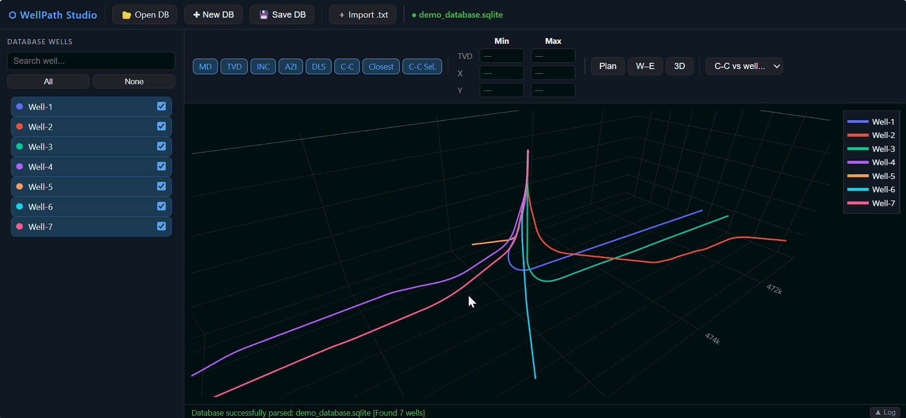

# WellPath Studio (Portable SQL/WASM Edition)



A browser-native application for visualizing directional drilling trajectories,
managing survey data in SQLite, and performing basic inter-well proximity analysis.

## Overview

This project demonstrates how modern browser technologies can be used to build
engineering tools without requiring a backend server.

Key technologies:

- SQLite running in WebAssembly (`sql.js`)
- Plotly WebGL for interactive 3D visualization
- Client-side file handling via the Browser File API
- Offline-first architecture

All processing occurs locally in the user's browser.

## Architecture

Input Files (.txt)
        ↓
Parser
        ↓
SQLite (sql.js / WASM)
        ↓
Trajectory Processing
        ↓
Plotly WebGL Visualization

## Features

### Local-Only Data Processing

- No backend services
- No cloud storage
- No external database connections
- Data remains on the user's machine

### SQLite Data Layer

- Create new databases
- Load existing `.sqlite` files
- Import multiple survey files
- Export processed datasets

### Visualization

- 3D trajectory view
- Plan view
- Section view
- Interactive filtering
- Well selection controls

### Clearance Analysis

- Nearest-neighbor distance calculations
- Reference-well proximity evaluation
- Interactive hover metrics

## Security Notes

This application does not transmit survey data to external systems.

The current version loads Plotly and SQL.js from public CDNs. For fully offline
or production deployments, these dependencies should be bundled locally.

## How to Run

### Clone the Repository

```bash
git clone https://github.com/Pablodf82/WellPath_Studio.git
```

### Launch

Open `index.html` directly in a modern browser.

### Workflow

1. Create a new database or open an existing one.
2. Import one or more COMPASS survey files.
3. Select wells for visualization.
4. Explore trajectories and proximity metrics.
5. Save the resulting SQLite database.

## Why This Project

This project was built as an exploration of:

- Browser-based engineering applications
- WebAssembly-powered analytics
- Offline-first data processing
- Lightweight deployment patterns

It demonstrates how desktop-style engineering workflows can be delivered through a single portable HTML application.
